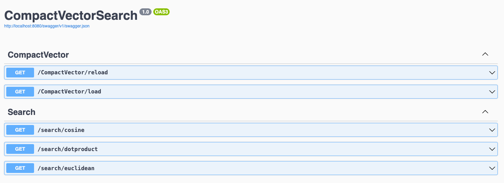

# CompactVectorSearch: High-Speed Vector Database for .NET

**CompactVectorSearch** is a .NET library designed for fast and accurate vector similarity searches in compact datasets. Perfect for small-scale applications, it excels in environments where large-scale solutions are overkill. This C# implementation offers a unique blend of performance, precision, and ease of use.

## Overview

CompactVectorSearch is a .NET vector database designed for efficient and precise semantic similarity searches in compact datasets. It can handle up to 200 items, delivering exceptional speed and accuracy. The system uses embedding vectors to represent text elements, which enables it to perform semantic similarity searches using cosine distance, Euclidean distance, or dot product. This process allows users to quickly and accurately identify the most semantically relevant items in the database.

### Embedding and Data Processing Workflow

- **Initial Data Preparation**: The process begins by taking a CSV file containing descriptions of functions or other text elements. 
- **Vector Embedding with Azure OpenAI**: Each description is then transformed into an embedding vector using Azure OpenAI's embedding model (specifically, the Ada-02 model). This model excels in capturing the semantic essence of text data.
- **JSON Storage**: After embedding, the vector data is saved as a JSON file on a storage system (I used Azure storage in this sample). This method ensures that the data is easily accessible and manageable.
- **In-Memory Data Handling**: Upon initialization, CompactVectorSearch loads this JSON data into memory. This approach allows for rapid access and search capabilities within the database.
- **Dynamic Query Processing**: When a search query is received, the system first converts the query text into an embedding vector using the same Ada-02 model. This ensures consistency in the representation of both the database items and the query.
- **Search Execution**: The embedded query is then compared against the database vectors using the chosen similarity measure (cosine distance, dot product, etc.). This comparison identifies the most semantically relevant database item to the query.

### Key Features

- **Efficient Semantic Searches**: Perform semantic similarity checks using cosine distance, Euclidean distance, or dot product.
- **Optimized for Small Datasets**: Specifically designed for datasets with fewer than 200 items, ensuring rapid response times, typically under 20ms.
- **Custom Code Base**: Built from the ground up with custom code, minimizing memory and code footprint and avoiding dependency on heavy external packages.

## Sample Use Cases

- **Natural Language to API Call Mapping**:
  - **Customer-Oriented Function Selection**: CompactVectorSearch revolutionizes how clients interact with a repository of API functions. Instead of navigating through complex technical documentation or requiring precise function names, customers can simply use natural language to describe their needs.
  - **Semantic Matching for API Execution**: For instance, consider a repository with diverse functions like calculating average temperatures for a region or generating commission statements for agents. When a customer inputs a query in natural language, CompactVectorSearch analyzes the semantic closeness of this input to the descriptions of available API functions. If the customer's query semantically aligns more closely with a weather forecast request, the corresponding API for weather data is automatically triggered and executed.
  - **Enhancing User Experience and Accessibility**: This feature significantly enhances the user experience, making the system more accessible and user-friendly. It allows non-technical users to interact with complex systems using simple, everyday language, thereby bridging the gap between technical functionality and practical usability.
- **Customer Service Enhancement**: Assists in identifying the right solutions quickly in customer service scenarios, either via chatbots or human interaction.

## How It Works

CompactVectorSearch operates on the principle of vector space modeling, transforming text elements into embedding vectors. This conversion allows the library to perform semantic similarity checks efficiently. Here's a breakdown of its core functionality:

### Vector Representation

- **Text to Vector Transformation**: Each text element is converted into an embedding vector. These vectors represent the semantic essence of the text, making them ideal for similarity checks.

### Semantic Similarity Checks

**Semantic Similarity Checks**: This refers to the process of determining how closely related or similar two pieces of content (typically text) are. In the context of vectors, this content is represented as vectors in a multidimensional space. There are three methods of measuring similarity implemented in CompactVectorSearch:

- **Using Cosine Distance**: This is a method to measure similarity by calculating the cosine of the angle between two vectors. If the cosine value is close to 1, it indicates high similarity. This method effectively captures the orientation (but not magnitude) of vectors and is widely used in text analysis.

- **Euclidean Distance**: This is another method of measuring similarity, which calculates the 'straight-line' distance between two points (or vectors) in space. It is the most direct way of measuring distance, but in high-dimensional spaces (like those often involved in text analysis), it can sometimes be less effective due to the curse of dimensionality.

- **Dot Product**: This is a measure that multiplies corresponding entries of two vectors and sums up the results. In the context of similarity checks, a higher dot product can indicate more similarity, especially when vectors are normalized.

Each of these methods offers a different perspective on how vectors (and thus, the text or data they represent) can be considered similar. They are commonly used in various applications, including information retrieval, natural language processing, and data analysis. Your sentence correctly implies that CompactVectorSearch can utilize any of these methods to perform semantic similarity checks.

### Efficient Search in Compact Databases

- **Optimized for Less than 200 Items**: Specifically designed for small datasets, CompactVectorSearch maintains high performance even with a limit of 200 items.
- **Rapid Response Time**: Thanks to its efficient design and the inherent simplicity of small datasets, the response time for a query is typically less than 20ms.

### Custom Implementation
- **Minimal Footprint**: The library is built with custom code, eschewing bulky packages for a leaner memory and code footprint.
- **Fast and Lightweight**: Its streamlined design ensures that searches are not only accurate but also remarkably fast.

This unique combination of features makes CompactVectorSearch an invaluable tool in scenarios where precision, speed, and efficiency are paramount, especially in constrained environments like small datasets or memory-limited applications.

## Getting Started

### Docker Integration

CompactVectorSearch comes with an included Dockerfile, which encapsulates the entire library and its functionalities. This Docker container is designed to expose several search routes, each corresponding to a different similarity measure method (cosine distance, Euclidean distance, and dot product). This setup serves as a practical example of how CompactVectorSearch can be integrated into a larger system.

### Implementing as a Service

- **Minimal Memory Footprint**: One of the core advantages of CompactVectorSearch is its minimal memory requirement. This makes it ideal for deployment in environments with limited resources or where multiple services need to run concurrently without impacting each other's performance.

- **Usage as a Database Service (DBService)**: The library is intended to be used as a DBService within your web API server. This approach allows other services in your system to interact with CompactVectorSearch as if it were a standard database service.

- **Singleton Pattern**: For optimal performance and resource management, it is recommended to implement CompactVectorSearch as a singleton service within your application. This ensures that only one instance of the service is created and maintained throughout the application's lifecycle, thereby reducing memory usage and improving response times. Each component is thread safe.

This setup enables CompactVectorSearch to function seamlessly within your application, providing a fast, efficient, and scalable solution for vector similarity searches in small datasets.

## Repository Structure

This section provides an overview of the key directories and files in the CompactVectorSearch repository. Understanding this structure will help you navigate and utilize the project effectively.

### Project Overview

- `CompactVectorSearch/`: Root directory of the project.

#### Key Directories

- `assets/`: Contains sample CSV and JSON files (`function.csv` and `FunctionCollection.json`) used for testing and demonstration purposes.
- `tests/`: Includes testing files such as `test.rest` for testing your endpoints.
- `media/`: Holds media files like `header.png` used in the project documentation.

#### Source Code

- `src/`: The main source code of the project.
  - `Api/`: Contains the API logic of the application.
    - `Controllers/`: Houses controller classes like `CompactVectorController` and `SearchController`.
    - `VectorDbService.cs`: Service for handling vector database operations.
  - `VectorLibrary/`: Core library of the project.
    - `Collections/`: Contains collections used in the project.
    - `Interfaces/`: Holds interface definitions.
    - `Models/`: Contains data models.
    - `Utils/`: Utility functions and helpers.

#### Configuration and Documentation

- `Dockerfile`: Docker configuration for setting up the project environment.
- `application.env`: Contains environment variables used by the application.
- `Program.cs`: The entry point of the .NET application.
- `README.md`: The main documentation file for the project, detailing usage, setup, and other important information.
- `LICENSE.md`: Information about the project's license.
- `CompactVectorSearch.csproj`: The .NET project file containing configuration and dependencies.
